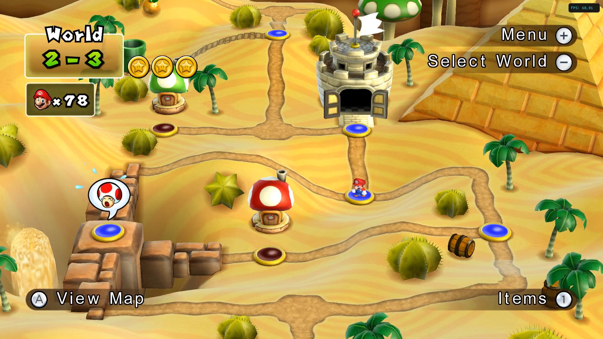

# VideoGame-Snippets-Database 
Video games snippets in high resolution

## Why this project ?

I have been playing around with emulators and game launchers like pegasus-fe, emulationstation, etc. which display snippets of the video games while browsing the library. That is very nice, but all snippets provider have videos in original resolution for the games. However, for many old consoles, emulators allow upscaling and custom textures, making the games look way better. 

So the goal of this database, is to provide some upscaled videos, so that the snippets look better ! This may not fit everyone as some prefer the "authentic" look of the games, but no worries, this db is just an option among the others.

Here is an example with New Super Mario bros Wii (click to enlarge) :

Original resolution, up to 576p :


Upscaled to 1080p and with custom textures :



## How does it work ?

Quite a lot of videos showcasing upscaled version of games (with and without texture packs) are already available on the internet. The biggest video platform for this is youtube. So instead of uploading and storing videos just for the database, what is stored is youtube video IDs, together with a timestamp of the snippet.

### Structure of the database

Every system is represented by a json file, each game for the system is like so :

```
{
    "name": "Name Of The Game",
    "id": "Id of the game, can be found online",
    "videoId": "Id of the youtube video",
    "timestamps": ["hh:mm:ss", "hh:mm:ss"]
}
```

## Contributing

### Adding game entries

Contributions are welcome, that's what will make this database complete !

First make sure that the game you want to add is not already present in the database. 
If a video has already been referenced, it can be replaced only for those reasons : the video is not available anymore, the video is not publicly visible, the video is not a video of the game, a "better version is available".

"Better" can be defined as such : better resolution (1080p -> 2160p for example) or addition of a texture pack.

If the game you want to add is not referenced, go ahead ! Make sure you try to find the "best" video possible, if it exists (highest resolution and with texture pack).

A few other guidelines :

- the video should not contain commentary, only music and dialogues from the game itself
- the video snippet should be 30s (timestamp1 - timestamp2 = 00:00:30)
- the snippet should contain some interesting playing action (avoid idle player moments), and should try to avoid spoilers
- the video can have been recorded on another system as long as the gameplay is exactly the same as the one on the current system

### Improving the database

Any feature can be suggested and discussed in the github issues tab

## Notes

I am aware of the low bitrate that youtube videos have. However, in most cases it is not problematic and will still look way better than low resolution/high bitrate videos. In the future, there might be higher quality and more resilient options, but for now, this is a great way to store videos.